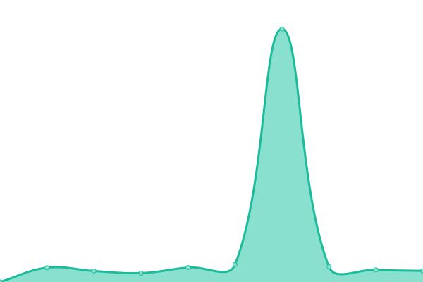

# [📈 Live Status](https://upptime.github.io/upptime): <!--live status--> **🟧 Partial outage**

This repository contains the open-source uptime monitor and status page for [Upptime](https://upptime.js.org), powered by [Upptime](https://github.com/upptime/upptime).

With [Upptime](https://upptime.js.org), you can get your own unlimited and free uptime monitor and status page, powered entirely by a GitHub repository. We use [Issues](https://github.com/upptime/upptime/issues) as incident reports, [Actions](https://github.com/djsnipa1/upptime/actions) as uptime monitors, and [Pages](https://upptime.github.io/upptime) for the status page.

<!--start: status pages-->
<!-- This summary is generated by Upptime (https://github.com/upptime/upptime) -->
<!-- Do not edit this manually, your changes will be overwritten -->
<!-- prettier-ignore -->
| URL | Status | History | Response Time | Uptime |
| --- | ------ | ------- | ------------- | ------ |
|  [Writeguard](https://www.writeguard.com) | 🟥 Down | [writeguard.yml](https://github.com/djsnipa1/upptime/commits/HEAD/history/writeguard.yml) | 

 0ms
     
 | 

<a href="https://djsnipa1.github.io/upptime/history/writeguard">0.00%</a>
    

|  [bin](https://bin.djsnipa1.repl.co) | 🟥 Down | [bin.yml](https://github.com/djsnipa1/upptime/commits/HEAD/history/bin.yml) | 

 0ms
     
 | 

<a href="https://djsnipa1.github.io/upptime/history/bin">0.00%</a>
    

|  [lynx.re](https://lynx.re) | 🟩 Up | [lynx-re.yml](https://github.com/djsnipa1/upptime/commits/HEAD/history/lynx-re.yml) | 

 764ms
     
 | 

<a href="https://djsnipa1.github.io/upptime/history/lynx-re">100.00%</a>
    

|  [Pastery.net](https://pastery.net) | 🟩 Up | [pastery-net.yml](https://github.com/djsnipa1/upptime/commits/HEAD/history/pastery-net.yml) | 

 1229ms
     
 | 

<a href="https://djsnipa1.github.io/upptime/history/pastery-net">100.00%</a>
    

<!--end: status pages-->

[**Visit our status website →**](https://upptime.github.io/upptime)

## 📄 License

- Code: [MIT](./LICENSE) © [Upptime](https://upptime.js.org)
- Data in the `./history` directory: [Open Database License](https://opendatacommons.org/licenses/odbl/1-0/)
